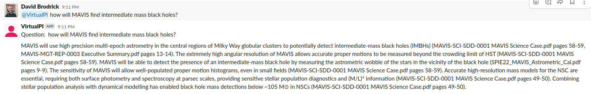

# Virtual PI

This script reads all of the PDFs in a directory, and uses a Large Language Model to make the document content available for answering natural language prompts, via Slack.

The script is trivial.. it just stands on the shoulders of giants such as [PaperQA](https://github.com/whitead/paper-qa/), [OpenAI Embeddings](https://platform.openai.com/docs/guides/embeddings), [FAISS](https://github.com/facebookresearch/faiss), [langchain](https://github.com/hwchase17/langchain), and [Slack Bolt](https://slack.dev/bolt-python/concepts).

Why the name? When your Principal Investigator goes on holidays, you need a *Virtual PI* to answer the difficult questions!

This work was first inspired by a conversation with the authors of [Galactic ChitChat: Using Large Language Models to Converse with Astronomy Literature](https://arxiv.org/abs/2304.05406), who implemented a similar tool, using a similar software stack. Virtual PI was first implemented and used for querying documentation for an astronomical instrument, [MAVIS](https://mavis-ao.org/).

## Configuration

To run the script, you require:
  * A directory with the PDFs you wish the expert system to ingest;
  * A working Python3 environment with the following packages available:
    * `pip3 install slack_bolt paper-qa==1.2`
    * NB: At the time of writing the default pip version of paper-qa and its langchain dependency are out of sync, hence requesting version 1.2.
  * An OpenAI [API key](https://help.openai.com/en/articles/4936850-where-do-i-find-my-secret-api-key).
  * You can [Create a new Slack app](https://api.slack.com/tutorials/tracks/responding-to-app-mentions) that is preconfigured with the neccessary permissions by pressing the green 'Create App' button on that link.
    * You can change the name of your app/bot (you'll use this to interact with it on Slack, by editing the 'manifest' file when the option is presented.
    * You will need to copy the App and Bot Tokens to set as environment variables, as described below.

The three API tokens you have generated should be exported to your shell environment at runtime:

```
export OPENAI_API_KEY="sk-M...M"
export SLACK_APP_TOKEN="xapp-1...d"
export SLACK_BOT_TOKEN="xoxb-2...C"
```

Then you can start the app as follows.

`python3 virtualpi.py /path/to/your/PDF/directory/`

After you run it the first time (when it embeds all of the documents), the script will exit and ask you to restart it (to avoid what appears to be a timeout issue in the Slack libraries).

## Saving State

When the script starts it will check if a pickled version of the dense vector containing the documents is already available in the PDF directory. If found it will use that existing state (which saves time and the cost of API calls), otherwise it will parse the PDFs, embed them into the FAISS dense vector and then save this state for next time.

NB: If you add/remove PDFs you will need to remove the state file!

`rm /path/to/your/PDF/directory/docs.pkl`

## Add to Slack Workspace

By now your app should be happily running. The final step is to actually add it to your Slack workspace.

  * In Slack, Click the '... More' on the top left.
  * Select 'Apps'.
  * Select the new app you created above.
  * Then go to a Slack channel and tag the app with a question e.g. `@WhateverYouCalledYourApp what is the meaning of this?`

**NB: The app will only respond to mentions in a Slack channel, not to DMs.**

An example interaction is shown below:

